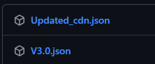

这是一个为 [SillyTavern](https://github.com/SillyTavern/SillyTavern) 量身打造的增强版脚本，需要预先安装 [JS-Slash-Runner](https://github.com/N0VI028/JS-Slash-Runner) 扩展。它通过一个独立的、功能强大的面板，让你能在一个界面中轻松管理所有世界书与正则表达式。

本脚本在社区网友分享版本的基础上，进行了大量的交互优化与功能增强。

---

## ✨ v3.3 更新速览

### 新增主题，样式细节优化

## 📋 功能一览表

| 功能分类       | 具体功能                         | 状态   |
| -------------- | -------------------------------- | ------ |
| **世界书管理** | 创建、删除、重命名世界书         | ✅      |
|                | 查看世界书使用者                 | ✅      |
|                | 批量启用/禁用世界书              | ✅      |
|                | 编辑世界书条目                   | ✅      |
|                | 聊天专属世界书（与当前聊天绑定） | ✅      |
|                | 孤立世界书一键筛选               | 🆕 v3.2 |
| **正则管理**   | 编辑正则表达式                   | ✅      |
|                | 查看执行顺序                     | ✅      |
|                | 拖拽调整顺序                     | ✅      |
|                | 与默认管理器保持一致             | ✅      |
| **批量操作**   | 多选模式                         | ✅      |
|                | 批量启用/禁用                    | ✅      |
|                | 批量删除书/条目                  | ✅      |
|                | 一键开启防递归                   | ✅      |
|                | 一键修复关键词                   | ✅      |
|                | 统一设置条目状态                 | 🆕 v3.1 |
| **界面体验**   | 浅色/深色主题支持                | ✅      |
|                | 搜索与过滤                       | ✅      |
|                | 搜索高亮与替换                   | ✅      |
|                | 实时数据同步                     | ✅      |
|                | 工具栏折叠/展开                  | 🆕 v3.0 |
|                | 条目排序与位置统一               | 🆕 v3.0 |
|                | 条目状态徽章与选择器             | 🆕 v3.1 |

---

## 🔥 核心功能详解

### 1. 统一管理面板

在一个面板中，通过标签页轻松切换和管理五种核心资源：全局世界书**, **角色世界书, 聊天世界书, 全局正则, 角色正则

### 2. 强大的编辑与过滤

- **快速搜索**：通过全局搜索框，快速找到您需要的任何项目。

- **精准过滤**：针对世界书，可按"书名"、"条目名"、"关键词"、"内容"进行组合筛选。

- **搜索高亮**：搜索结果自动高亮显示，匹配内容清晰可见。

- **智能替换**：支持批量替换功能，快速修改条目内容、关键词和名称。

- **在线编辑**：创建、重命名、删除世界书/条目，所有条目选项均可直接在线编辑。

- **快速启用/禁用**：一键切换世界书、条目或正则的启用状态。

### 3. 世界书专属增强

- 🔄 **智能重命名**：重命名世界书时，自动更新所有相关绑定关系，安全无忧。

- 🔗 **使用者查看**：清晰列出每本全局世界书被哪些角色使用，方便清理和维护。
  

- 🔧 **实用工具箱**：

  - **[全开防递归]**：一键为书中所有条目开启"防止递归""不可被递归"。

  - **[修复关键词]**：一键将所有中文逗号 `，` 替换为英文逗号 `,`，确保触发无误。

- 🆕 **统一位置**：一键将所有条目设置为相同插入位置（如“角色定义前”）。

### 5. 正则表达式顺序管理

- #️⃣ **顺序显示**：与SillyTavern默认管理器完全一致的顺序显示。

- ↕️ **拖拽排序**：通过拖拽即可调整正则表达式的执行优先级。

### 6. 完美的UI体验

- 🛡️ **样式隔离**：CSS作用域严格限制，绝不污染酒馆其他界面。

- 🆕 **工具栏优化**：支持折叠工具栏，节省空间；新增排序和位置菜单，提升操作流畅度。

---

## 🛠️ 安装与使用 (新增自动更新功能)

1. 确保您的酒馆安装了 [JS-Slash-Runner](https://github.com/N0VI028/JS-Slash-Runner) 扩展。

2. 前往本项目的 Releases 页面下载最新的 `.json` 文件。其中`Updated_cdn.json`为自动更新版本，每次加载SillyTavern会自动获取插件的最新版本。
   

3. 在SillyTavern的"扩展"界面中，找到"JS-Slash-Runner"，点击"导入脚本"。
   

4. 选择下载的 `.json` 文件，并确保脚本类型为 **"全局脚本"**。

5. 激活脚本，然后刷新浏览器。
   

6. 点击右上角的魔术棒图标，即可找到并打开【世界书＆正则便捷管理】。
   

---

## 🤝 贡献与反馈

如果您在使用过程中遇到问题或有改进建议，欢迎：

- 提交 Issue 报告问题

- 提交 Pull Request 贡献代码

- 在社区中分享使用心得

---

## 许可证

AGPL-3.0