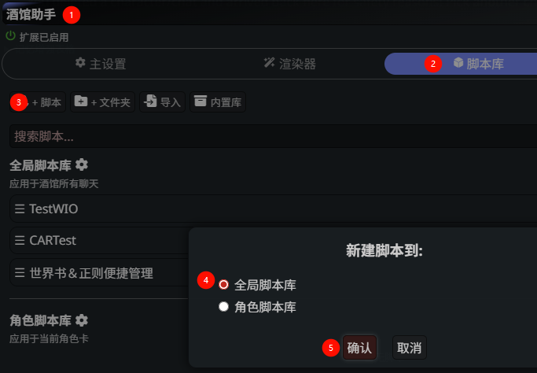
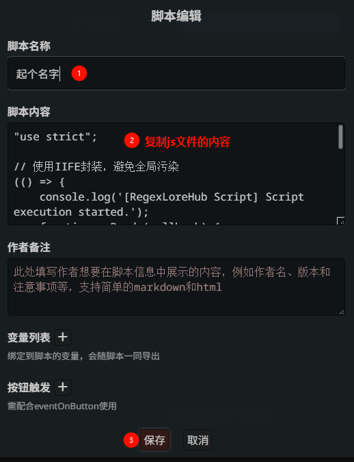

# WI Optimizer (世界书 & 正则便捷管理) - 增强版

这是一个用于 [SillyTavern](https://github.com/SillyTavern/SillyTavern) 的增强版脚本，旨在提供一个集中、高效的界面来管理全局和角色的世界书（Lorebooks）与正则表达式。

脚本基于扩展[GitHub - N0VI028/JS-Slash-Runner](https://github.com/N0VI028/JS-Slash-Runner),需要提前安装.

该脚本通过添加一个独立的管理面板，提供了便捷的使用情况查看、批量操作、顺序管理等功能，尤其适合拥有大量世界书和角色的用户。

本脚本改动自[DISCO](https://discord.com/channels/1291925535324110879/1389953145035296858/1393474010511048764)网友的制作，并进行了大量功能增强和优化。

## 整体功能

WI Optimizer 提供了一个功能丰富的管理面板，您可以进行以下操作：

- **统一视图**：在一个面板中查看和管理全局世界书、角色专属世界书、全局正则表达式和角色正则表达式。
- **快速切换**：通过顶部的标签页在不同类型的项目之间轻松切换。
- **实时搜索与过滤**：
    - 全局搜索框可以快速查找世界书或正则表达式。
    - 针对世界书，可以按“书名”、“条目名”和“关键词”进行组合过滤，精准定位。
- **完整的编辑功能**：
    - 直接在面板中创建、重命名、删除世界书和其中的条目。
    - 点击条目即可展开详细的编辑器，所有世界书条目选项（如插入位置、权重、激活逻辑等）均可可视化编辑。
    - 正则表达式的查找内容、替换内容、作用范围等均可直接修改。
- **启用/禁用切换**：一键切换世界书、条目或正则表达式的启用状态，修改即时生效。
- **多选模式**：进入多选模式后，可以批量选择项目，并进行批量启用或禁用的操作。
- **🆕 正则顺序管理**：与 SillyTavern 默认正则管理器完全一致的顺序显示和调整功能。
- **🆕 世界书重命名**：支持世界书重命名，自动维护角色卡绑定关系。
- **🆕 主题兼容性**：完美支持浅色和深色主题，不影响酒馆其他界面。

---

## ✨ 新增亮点功能

此版本在原有基础上进行了大量功能增强和优化，核心是提升批量管理效率、正则顺序管理和使用便捷性。

### 1. 📖 世界书使用者追踪 `(原有功能)`

- **功能描述**：在“全局世界书”标签页中，每本世界书下方会清晰地列出当前正在使用它的所有角色名称。
- **解决痛点**：当您想要清理或修改一本世界书时，常常不确定它是否还被某些角色依赖。此功能让世界书的引用关系一目了然，您可以放心地进行删除或修改，避免误操作。

### 2. 📝 世界书重命名功能 `(新增)`

- **功能描述**：支持对世界书进行重命名操作，并自动维护所有相关的绑定关系。
- **智能关联更新**：
  - 自动更新所有角色卡的世界书绑定关系
  - 自动更新全局世界书启用设置
  - 完整复制所有条目到新世界书
  - 安全删除旧世界书
- **解决痛点**：以前重命名世界书需要手动重新绑定所有角色，现在一键完成所有操作。

### 3. ⚡ 正则表达式顺序管理 `(新增)`

- **执行顺序可视化**：每个正则表达式前显示 `#1`, `#2`, `#3` 等执行顺序标识
- **与 SillyTavern 完全一致**：
  - 显示顺序 = 执行顺序，与默认正则管理器保持一致
  - 支持上移/下移调整执行优先级
  - 作用域隔离：全局正则和角色正则分别管理
- **直观操作**：
  - 🔼 上移：提高执行优先级（更早执行）
  - 🔽 下移：降低执行优先级（更晚执行）
- **解决痛点**：无需在多个界面间切换，直接在统一面板中管理正则执行顺序。

### 4. 🎨 主题兼容性优化 `(新增)`

- **完美主题支持**：
  - 修复了浅色主题下文本显示不清的问题
  - 优化了禁用状态条目的视觉效果
  - 限制 CSS 作用域，避免影响酒馆其他界面
- **解决痛点**：解决了脚本开启后整个酒馆字体颜色变浅的问题。

### 5. 🚀 强大的批量操作 `(原有功能)`
 
为了应对大量的世界书条目，新增了多项一键批量处理功能：

- **批量删除世界书**：
  - 在多选模式下，现在可以勾选多个世界书，然后点击“批量删除”按钮一次性移除它们，极大提高了清理效率。
- **一键开启防递归**：
  - 在每个世界书的条目列表顶部，新增了 **`[全开防递]`** 按钮。点击后，会自动为该世界书下的 **所有条目** 开启“防止递归”选项。
  - **解决痛点**：避免手动逐个点开条目设置，对于防止意外的递归循环非常有用。
- **一键修复关键词**：
  - 新增 **`[修复关键词]`** 按钮。点击后，会自动扫描该世界书下所有条目的关键词，并执行以下操作：
    - 将所有中文逗号 `，` 统一替换为英文逗号 `,`。
  - **解决痛点**：确保关键词格式的统一与正确，避免因格式问题导致世界书无法被正确触发。

### 6. 🎨 UI/UX 优化 `(持续改进)`

- **界面微调**：对面板的布局和样式进行了优化，使信息展示更加清晰，操作更加流畅。
- **数据加载**：改进了后端数据的加载和刷新逻辑，使其更加稳定和高效。
- **视觉反馈**：增强了操作成功提示和状态显示。

---

## 🔥 核心特性一览

| 功能分类       | 具体功能                 | 状态       |
| -------------- | ------------------------ | ---------- |
| **世界书管理** | 创建、删除、重命名世界书 | ✅ 完整支持 |
|                | 世界书使用者追踪显示     | ✅ 完整支持 |
|                | 批量启用/禁用世界书      | ✅ 完整支持 |
|                | 世界书条目编辑           | ✅ 完整支持 |
| **正则管理**   | 正则表达式编辑           | ✅ 完整支持 |
|                | 执行顺序可视化           | 🆕 新增功能 |
|                | 上移/下移调整顺序        | 🆕 新增功能 |
|                | 与默认管理器一致性       | 🆕 新增功能 |
| **批量操作**   | 多选模式                 | ✅ 完整支持 |
|                | 批量启用/禁用            | ✅ 完整支持 |
|                | 批量删除世界书           | ✅ 完整支持 |
|                | 一键开启防递归           | ✅ 完整支持 |
| **界面体验**   | 浅色/深色主题支持        | 🆕 优化完善 |
|                | 搜索与过滤               | ✅ 完整支持 |
|                | 实时数据同步             | ✅ 完整支持 |

## 安装与使用

1.  确保您的酒馆安装了 [酒馆助手](https://github.com/N0VI028/JS-Slash-Runner)
2.  在扩展界面中，在“酒馆助手”的页面下添加脚本
    
3.  起个名字，并将JS文件的内容复制进去后保存
    
4.  刷新浏览器
5.  在魔术棒中点开使用
    

## 📋 更新日志

### v2.0 增强版 (最新)
- 🆕 **正则顺序管理**：添加执行顺序可视化和上移/下移功能
- 🆕 **世界书重命名**：支持世界书重命名并自动维护绑定关系
- 🆕 **主题兼容性**：修复浅色主题显示问题，避免影响酒馆其他界面
- 🔧 **顺序一致性**：确保正则显示顺序与 SillyTavern 默认管理器完全一致
- 🎨 **视觉优化**：添加执行顺序标识符，改善禁用状态显示效果

### v1.0 基础版
- ✅ 世界书使用者追踪
- ✅ 批量操作功能
- ✅ 一键开启防递归
- ✅ 关键词修复功能
- ✅ 多选模式
- ✅ 搜索与过滤

## 🤝 贡献与反馈

如果您在使用过程中遇到问题或有改进建议，欢迎：
- 提交 Issue 报告问题
- 提交 Pull Request 贡献代码
- 在社区中分享使用心得

## 许可证

AGPL-3.0
