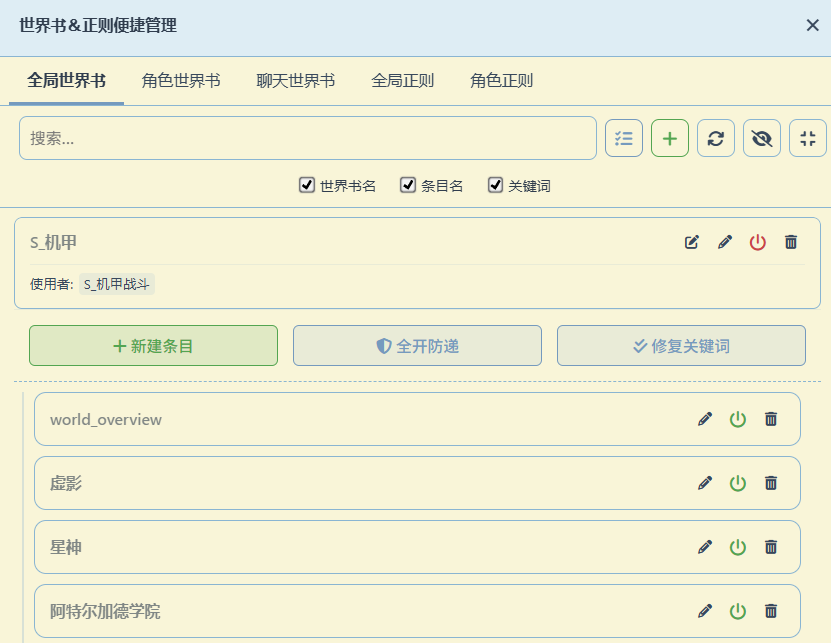
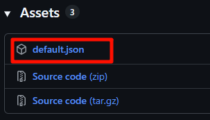
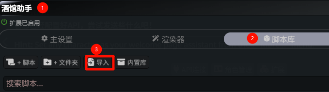

这是一个为 [SillyTavern](https://github.com/SillyTavern/SillyTavern) 量身打造的增强版脚本，需要预先安装 [JS-Slash-Runner](https://github.com/N0VI028/JS-Slash-Runner) 扩展。它通过一个独立的、功能强大的面板，让你能在一个界面中轻松管理所有世界书与正则表达式。

本脚本在社区网友分享版本的基础上，进行了大量的交互优化与功能增强，旨在解决用户在管理大量条目时的核心痛点，让您的使用体验更加流畅自然。

---

## 🚀 v2.7 版本核心亮点

最新版本围绕 **"搜索增强"** 和 **"替换功能"** 进行了全面升级，让您的管理工作更加高效便捷。

- 🔍 **内容搜索增强**：新增"内容"搜索选项，支持在世界书条目内容中搜索关键词，查找信息更精准。
- 💡 **搜索结果高亮**：实现搜索关键词高亮显示功能，匹配结果一目了然，提升搜索体验。
- 🔄 **智能替换功能**：新增内容替换功能，支持批量替换条目中的关键词、内容和条目名称，编辑更高效。(不支持世界书名替换)

---

## 📋 功能一览表 (🆕in V2.7)

| 功能分类 | 具体功能 | 状态 |
| --- | --- | --- |
| **世界书管理** | 创建、删除、重命名世界书 | ✅ 完整支持 |
| | 查看世界书使用者 | ✅ 完整支持 |
| | 批量启用/禁用世界书 | ✅ 完整支持 |
| | 编辑世界书条目 | ✅ 完整支持 |
| | 聊天专属世界书(与当前聊天绑定的世界书) | ✅ 完整支持 |
| **正则管理** | 编辑正则表达式 | ✅ 完整支持 |
| | 查看执行顺序 | ✅ 完整支持 |
| | 拖拽调整顺序 | ✅ 完整支持 |
| | 与默认管理器保持一致 | ✅ 完整支持 |
| **批量操作** | 多选模式 | ✅ 完整支持 |
| | 批量启用/禁用 | ✅ 完整支持 |
| | 批量删除书/条目 | ✅ 完整支持 |
| | 一键开启防递归 | ✅ 完整支持 |
| | 一键修复关键词 | ✅ 完整支持 |
| **界面体验** | 浅色/深色主题支持 | ✅ 完整支持 |
| | 搜索与过滤 | ✅ 完整支持 |
| | 搜索高亮与替换 | 🆕 新增 |
| | 实时数据同步 | ✅ 完整支持 |

---

## 🔥 核心功能详解

### 1. 统一管理面板

在一个清爽的面板中，通过标签页轻松切换和管理五种核心资源：
- **全局世界书**
- **角色世界书**
- **聊天世界书**
- **全局正则**
- **角色正则**

### 2. 强大的编辑与过滤

- **快速搜索**：通过全局搜索框，快速找到您需要的任何项目。
- **精准过滤**：针对世界书，可按"书名"、"条目名"、"关键词"、"内容"进行组合筛选。
- **搜索高亮**：搜索结果自动高亮显示，匹配内容清晰可见。
- **智能替换**：支持批量替换功能，快速修改条目内容、关键词和名称。
- **在线编辑**：创建、重命名、删除世界书/条目，所有条目选项均可直接在线编辑。
- **快速启用/禁用**：一键切换世界书、条目或正则的启用状态。

### 3. 批量操作，效率翻倍

进入 **多选模式**，即可使用强大的批量处理功能：
- **批量启用/禁用**
- **批量删除 (支持世界书和条目混合选择)**

### 4. 世界书专属增强

- 🔄 **智能重命名**：重命名世界书时，自动更新所有相关绑定关系，安全无忧。
- 🔗 **使用者查看**：清晰列出每本全局世界书被哪些角色使用，方便清理和维护。
- 🔧 **实用工具箱**：
    - **[全开防递]**：一键为书中所有条目开启"防止递归"。
    - **[修复关键词]**：一键将所有中文逗号 `，` 替换为英文逗号 `,`，确保触发无误。

### 5. 正则表达式顺序管理

- #️⃣ **顺序显示**：与SillyTavern默认管理器完全一致的顺序显示。
- ↕️ **拖拽排序**：通过拖拽即可调整正则表达式的执行优先级。

### 6. 完美的UI体验

- 🎨 **主题兼容**：完美适配浅色与深色主题，修复了原版在浅色主题下的显示问题。
- 🛡️ **样式隔离**：CSS作用域严格限制，绝不污染酒馆其他界面。

---

## 🛠️ 安装与使用

### 方法1: 导入Release中的Json文件 (推荐)

1. 确保您的酒馆安装了 [JS-Slash-Runner](https://github.com/N0VI028/JS-Slash-Runner) 扩展。
2. 前往本项目的 Releases 页面下载最新的 `.json` 文件。
   
3. 在SillyTavern的"扩展"界面中，找到"JS-Slash-Runner"，点击"导入脚本"。
   
4. 选择下载的 `.json` 文件，并确保脚本类型为 **"全局脚本"**。
5. 激活脚本，然后刷新浏览器。
   
6. 点击右上角的魔术棒图标，即可找到并打开【世界书＆正则便捷管理】。
   

### 方法2: 直接复制源代码

1. 确保您的酒馆安装了 [JS-Slash-Runner](https://github.com/N0VI028/JS-Slash-Runner)。
2. 在"JS-Slash-Runner"的设置页面下，点击"添加新脚本"。
   
3. 为脚本起一个名字（例如 `WI_Optimizer`），将 `WI_Optimizer.js` 文件的全部内容复制进去，然后保存。
   
4. 激活脚本，刷新浏览器，即可在魔术棒菜单中使用。

---

## 📜 更新日志

### v2.7 搜索与替换功能增强 (最新)
- 🔍 **新增内容搜索**：在搜索过滤器中新增"内容"选项，支持搜索世界书条目的具体内容。
- 💡 **搜索结果高亮**：实现搜索关键词高亮功能，匹配的文本以黄色背景突出显示。
- 🔄 **智能替换功能**：新增内容替换功能，支持批量替换条目中的关键词、内容和条目名称。
- 🎨 **编辑器优化**：将内容编辑器改为contenteditable div，支持高亮显示并保持格式。
- 🔧 优化了搜索功能，现在能正确处理包含特殊符号的内容。
- 🧹 修复了可能导致程序卡死的问题，提高了程序稳定性。
- 🛡️ 增强了程序的自我修复能力，在异常情况下能自动恢复正常。
- 🔧 修复了世界书重命名功能中角色卡绑定关系未同步更新的问题。
- 🔍 增强了世界书重命名过程的调试信息和错误处理。

**新增功能详解：**
- ✨ **内容搜索**：除了书名、条目名、关键词外，现在还可以搜索条目的具体内容
- ✨ **关键词高亮**：搜索匹配的文本自动以黄色背景高亮显示，提升查找效率
- ✨ **批量替换**：在搜索框下方新增替换输入框和替换按钮，支持一键替换所有匹配项
- ✨ **替换范围**：替换功能支持条目的关键词、内容和条目名称，但不会修改世界书本身的名称

**已修复的问题：**
- ✅ `safeDeleteLorebookEntries` 和 `safeClearLorebookEntries` 的无限递归问题
- ✅ 搜索高亮在特殊符号（如 `<`、`>`、`&` 等）下失效的问题
- ✅ 世界书重命名功能中角色卡绑定关系未同步更新的问题
  - 修复了角色索引获取方法，使用正确的 `Character.findCharacterIndex()` API
  - 增强了角色切换和世界书绑定更新的调试信息
  - 改进了内部映射关系的同步更新机制

### v2.6 Bug修复与体验优化
- 🔧 **关键Bug修复**: 修复了批量删除功能无法正常工作的问题。
- 🎨 **提示信息优化**: 改进了批量删除时的确认提示信息，使其更清晰易懂。
- 🔍 **搜索功能增强**: 在世界书搜索中新增"内容"选项，搜索更精准。

### v2.5 交互重构与功能完善
- 🆕 **聊天专属世界书**: 添加了对聊天专用世界书的全面支持。
- 🚀 **批量删除增强**: 多选模式下现在可以精确删除单个条目。
- ✨ **操作优化**: 引入"编辑条目"模式，使操作更加清晰明了。
- 🔧 **稳定性提升**: 修复了可能导致程序崩溃的问题。
- 🎨 **界面优化**: 优化了界面视觉效果和用户体验。

### v2.0 增强版
- 🔧 **功能修复**：修复了世界书重命名功能中的问题。
- 🆕 **正则顺序管理**：可以查看和调整正则表达式的执行顺序。
- 🆕 **世界书重命名**：支持世界书重命名并自动维护相关关系。
- 🆕 **主题兼容性**：优化了在不同主题下的显示效果。

### v1.0 基础版
- ✅ 世界书使用者查看
- ✅ 批量操作功能
- ✅ 一键开启防递归
- ✅ 关键词修复功能
- ✅ 多选模式
- ✅ 搜索与过滤

---

## 🧪 兼容性与稳定性

本脚本经过精心设计和测试，确保与SillyTavern环境的兼容性，并具有良好的稳定性：

- **避免冲突**：脚本采用了隔离技术，确保其运行不会影响酒馆的其他功能。
- **样式独立**：界面样式独立设计，不会干扰酒馆的其他界面元素。
- **稳定加载**：通过多种保护机制，确保在各种情况下都能稳定加载和运行。
- **搜索优化**：优化了搜索功能，确保在各种特殊符号下都能正常工作。
- **问题修复**：已发现并修复了可能导致程序异常的问题，提高了整体稳定性。

我们致力于提供一个稳定、可靠的用户体验，让您能够安心使用本脚本的所有功能。

## 🤝 贡献与反馈

如果您在使用过程中遇到问题或有改进建议，欢迎：
- 提交 Issue 报告问题
- 提交 Pull Request 贡献代码
- 在社区中分享使用心得

## 许可证

AGPL-3.0